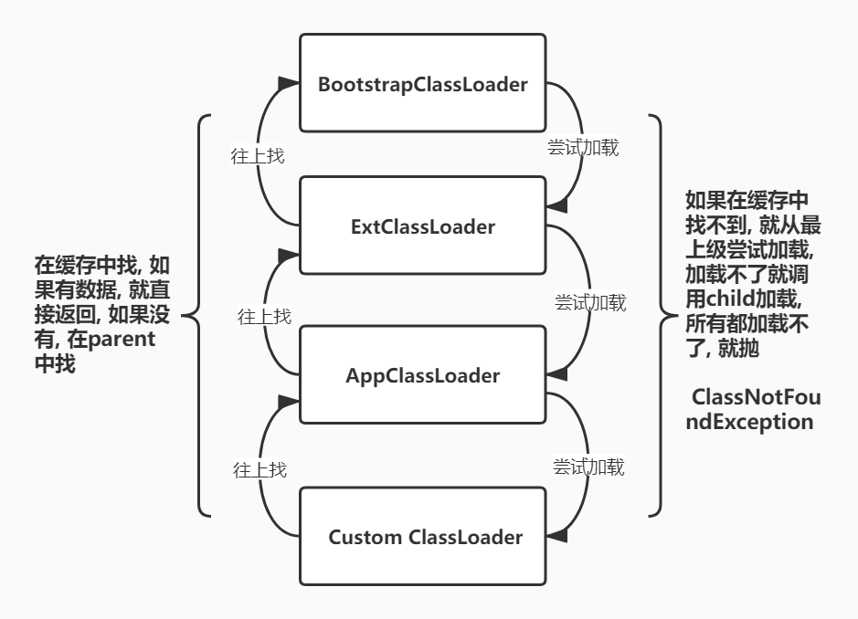

# JVM (Java Virtual Machine)(2)

### 类加载过程

1. 加载

   根据类的全限定名, 找到 class 文件, 读取出二进制流, 将该字节流所代表的静态数据结构转化为方法区中运行的数据结构，并且在堆内存中生成一个 java.lang.Class 对象作为访问方法区数据结构的入口

2. 连接

   1. 验证 -> 校验字节码文件是否符合 jvm 规范
   2. 准备 -> 给静态变量赋默认值
   3. 解析 -> 将常量池中的符号引用转换为直接引用

3. 初始化

   执行初始化方法

### 类加载器

1. BootstrapClassLoader -> 加载 java 核心库, rt.jar 等
2. ExtClassLoader -> 加载 ext 包下的 jar
3. AppClassLoader -> 加载 classpath 的类
4. 自定义加载器 -> 自定义加载

### 双亲委派模型

